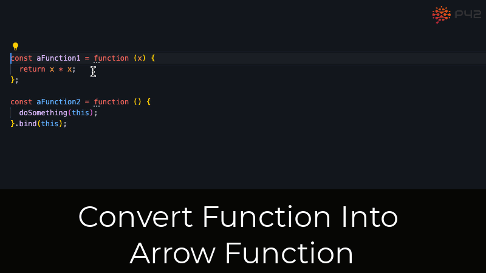

# JavaScript 

Na aulona de hoje trataremos de:

- Funções:

    - Regular Functions
    - Arrow Functions


## Apresentações

### Profs - Sôra - Professora


* Paraense / Taurina / 28 anos / Transexual / Dorameira & Army & Otakeira / Estudante de coreano
* Residindo no RS / Ex English teacher / Graduada em arquitetura e urbanismo / Em transição de carreira

    - [Github](https://github.com/laraof)
    - [LinkedIn](https://www.linkedin.com/in/lara-oliveira-%F0%9F%8F%B3%EF%B8%8F%E2%80%8D%E2%9A%A7%EF%B8%8F-a653a4121/)
    - [Instagram](https://www.instagram.com/lara.f.arq/)


### Monitoras - Anjas


Responsáveis por ajudá-las quando a profs estiver meio louca durante a aula, pode chamar as mesmas em uma sala privada para melhor apoio.

### Alunas - Front-enders


Responsáveis por prestar atenção, tirar todas as dúvidas (nenhuma dúvida é fútil ou irrelevante), e exercitar bastante para se tornarem devas maravilhosas.


## Olha a aula - SE LIGA EM...


### Funções

## O que é uma função??? 


    ```
        function nameOfFunction(parameter1, parameter2, ..., parameterX) {
                // function's body
        };
    ```

    ```
        function sistemaRespiratorio() {
            const entradaSaidaAr = "narinas"
            const trocaGasosa = "pulmoes"

            console.log(`O sistema respiratório consiste em trocas gasosas pelas ${entradaSaidaAr} com entrada de O2, passando pelos ${trocaGasosa} e expelindo o CO2 novamente pelas ${entradaSaidaAr}`)
        }

        sistemaRespiratorio();
    ```

Bloco de código com instruções predefinidas, executável e que pode ser reutilizado.

- Regular Function

    

    ```
        function nameOfFunction(parameter1, parameter2, ..., parameterX) {
                // function's body
        };
    ```

    Conhecida por função regular, justamente por ser a forma tradicional de se escrever uma função em javascript.

    ```
        function soma (a, b) {
            return a + b
        };
    ```
    Para que uma função possa ser executada precisamos invocar (chamar), a mesma. 

    ```
        function soma(a, b) {
            return a + b
        };

        soma(3, 4);
    ```

    Outro exemplo...

    ```
        function leguminosasFavoritas(primeiraLeguminosa, segundaLeguminosa) {
            console.log(`Minhas leguminosas favoritas são ${primeiraLeguminosa} e ${segundaLeguminosa}`)
        };

        leguminosasFavoritas(beterraba, rabanete);
    ```

    Mão no código, manas!!!

- Arrow Function 

    

    ```
        const variableName = () => {
            // function's body
        };
    ```

    Forma abreviada de escrever uma função, onde temos de omitir a nomenclatura `function` e não precisamos nomear a função.

    ```
        const soma = (a, b) => {
            return a + b
        };

        console.log(soma);
    ```
    Podemos abreviar ainda mais o bloco de código acima:

    ```
        const soma = (a, b) =>  a + b

        console.log(soma);
    ```

    Outro exemplo...

    ```
        const corDaRoupa = () => ({
            Casaco: "Verde",
            Blusa: "Branca",
            Shorts: "Branco"
            Sapato: "Vermelho"
        });

        console.log(corDaRoupa());
    ```

    Bora dá-lhe no código, manas!!!

    


## Referências 

* https://betterprogramming.pub/difference-between-regular-functions-and-arrow-functions-f65639aba256
* https://www.freecodecamp.org/news/javascript-function-iife-parameters-code-blocks-explained/
* https://www.w3schools.com/js/js_functions.asp
* https://dmitripavlutin.com/differences-between-arrow-and-regular-functions/